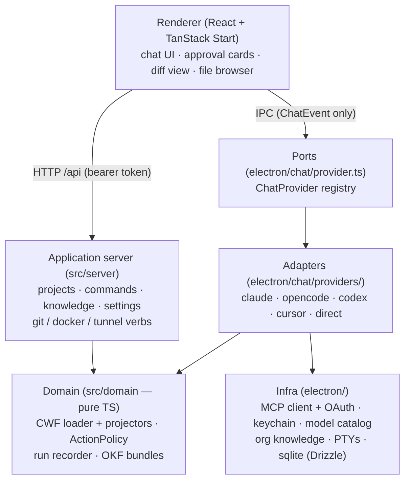
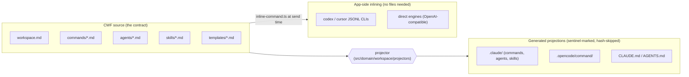
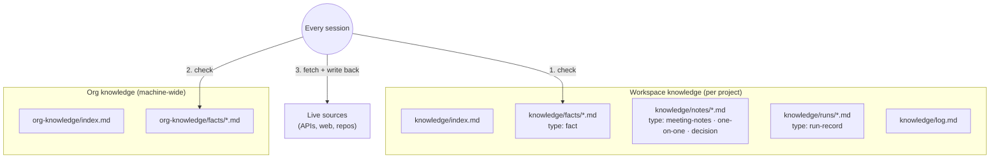
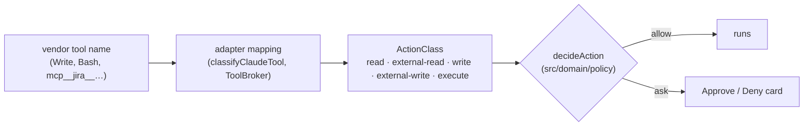
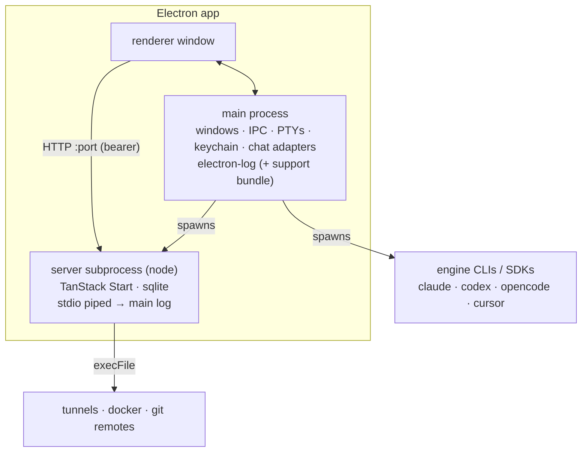

# Concourse Architecture

How the app is put together, and why. Code comments reference the numbered
sections (`§1`, `§4`, `§5`) — keep the numbering stable.

The two load-bearing ideas:

1. **Files are the contract; engines are visitors.** The durable assets are
   plain-markdown formats — CWF for workspaces (§2), OKF for knowledge (§3).
   Any AI engine executes the same files; none of them owns the data.
2. **One port per concern, one adapter per vendor.** Vendor SDKs and CLIs are
   quarantined behind small interfaces so swapping or adding an engine is one
   file, not a refactor (§1, §5).

## §1 Layers



Invariants the layering enforces:

- The renderer speaks **ChatEvent** to chats and HTTP to the server — it never
  sees vendor tool names or key material (booleans only cross IPC; secrets
  live in the OS keychain via `safeStorage`).
- Only `electron/chat/providers/claude.ts` may import the Claude Agent SDK.
  Every engine is one adapter file behind the `ChatProvider` port.
- The domain layer is pure TS (no Electron, no HTTP) so policy and formats are
  testable and portable.

## §2 CWF — the workspace format

CWF (Concourse Workspace Format) is the provider-neutral source of truth for
a project's AI setup: `workspace.md` plus `commands/`, `agents/`, `skills/`,
`templates/`, `knowledge/` — markdown with YAML frontmatter, links as
structure. Vendor conventions are **generated projections** of it.



Generated files carry a sentinel comment; the projector owns them (manifest:
`concourse-projection.json`) and skips writes when hashes are unchanged.
Pre-existing `.claude/` content in an adopted repo is treated as a *legacy
source* and fanned out to the other providers too.

## §3 OKF — the knowledge layer

Knowledge follows **OKF (Open Knowledge Format)** — an open spec for agent-
friendly knowledge: every concept is a markdown file whose YAML frontmatter
carries a required `type` plus recommended `title`, `description`, `tags`,
`timestamp`; `index.md` gives progressive disclosure; `log.md` records dated
history; ordinary markdown links are the graph's (untyped, directed) edges.
Consumers must tolerate unknown types/fields — the format is built for
agent-generated growth.

### Three scopes, one protocol



The **knowledge-first protocol** (scaffolded as a skill, and injected into
every session via the org-knowledge system prompt) is the same everywhere:
workspace facts → org facts → fetch live, then save durable discoveries back
to the right scope. Point-in-time numbers are never served from knowledge.

### Where knowledge lands: workspace vs. repo

One rule decides the physical location (`runRecordRoot`): **does the folder
have a `workspace.md`?**

- **CWF workspace** → knowledge *is* the product; everything goes in
  `knowledge/`, versioned with the workspace.
- **Engineering repo** → a machine-local `.concourse/` overlay holds
  `knowledge/` and `outputs/`, excluded via `.git/info/exclude` (never the
  shared `.gitignore`) so teammates never see it.

### How knowledge gets written

```mermaid
sequenceDiagram
    participant U as User
    participant Chat as Chat session (any engine)
    participant IPC as chat IPC (run tracer)
    participant K as knowledge/

    U->>Chat: /command … or plain message
    Note over IPC: every turn opens a run trace<br/>(command name, engine, model, t₀)
    Chat->>K: agent writes files (facts, notes, outputs)
    Note over Chat: meeting notes / 1:1s / decisions →<br/>knowledge/notes/&lt;date&gt;-&lt;slug&gt;.md (OKF concept)
    Chat-->>IPC: Write/Edit tool events observed
    Chat-->>IPC: turn settles (awaiting-input / error / stopped)
    alt command ran, or chat turn wrote files
        IPC->>K: runs/<date>-<cmd|chat>.md (type: run-record)
        IPC->>K: append dated line to log.md
        IPC->>K: ensure index.md
    else plain Q&A, nothing written
        IPC->>IPC: trace discarded — no record
    end
```

Two producers, deliberately different:

- **The app** writes *run records* deterministically from ChatEvents — every
  engine gets this for free, no engine cooperation needed.
- **The agent** writes *facts and notes* by following the protocol in its
  instructions — conversational content (meeting notes shared in a chat, a
  1:1, a decision) becomes a first-class OKF concept in `knowledge/notes/`,
  with durable facts extracted into `facts/` and linked as edges.

### Sharing: OKF bundles

A workflow exports as a plain-markdown folder — `index.md` manifest + the
command + its agents/skills/template, mirroring workspace layout. Any
workspace imports it collision-safe; any assistant without Concourse can
activate it by reading `index.md` and following links.

## §4 Approval policy

Approvals are decided in the domain from **capability classes**, never from
vendor tool names in UI code. Each adapter maps its native tools to an
`ActionClass`; `decideAction` returns allow/ask; the renderer's Approve/Deny
card is the "ask" surface.



| class | default | `autoApproveWrites` | `dangerouslySkipApprovals` |
|---|---|---|---|
| read, external-read | allow | allow | allow |
| write | ask | **allow** | allow |
| execute, external-write | ask | ask | **allow** |

`autoApproveWrites` is the workflow builder's narrow unlock;
`dangerouslySkipApprovals` is the per-session shield toggle the user arms
before the first message (Codex chats map it to `danger-full-access`, lifting
the OS sandbox).

## §5 Engines

Two kinds of engine sit behind the same `ChatProvider` port:

| kind | adapters | how commands run | approvals |
|---|---|---|---|
| **harness** | claude (Agent SDK), opencode (server API), codex + cursor (JSONL CLIs) | native slash commands via projections, or app-side inlining | SDK callback (claude/opencode); pre-set sandbox, labeled honestly (codex/cursor) |
| **direct** | any OpenAI-compatible API (OpenAI, OpenRouter, Ollama, custom) | system-prompt inlining + a ToolBroker loop | per-action via ActionPolicy |

Harness sessions pin their model at start; direct engines are stateless per
request, so their model picker stays live mid-conversation. Model lists come
from a static registry upgraded by live discovery (`electron/models/`).

## §6 Runtime topology



Dev mode swaps the server subprocess for Vite (`pnpm dev`, port 5173, data in
`.dev-userdata/`); packaged builds write the chosen port to a `.port` file in
the user-data dir. Crashes from all three surfaces (main, renderer, server)
land in one rotating log file, exportable as a support bundle from
Settings → General.
